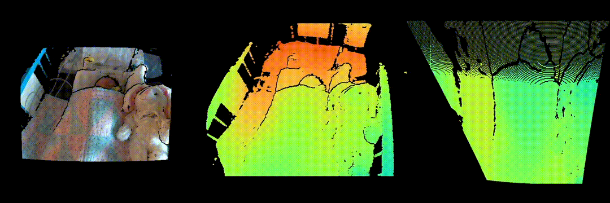

<!-- Add banner here -->
<!--  -->

# DepthSliceTool

<!-- Add buttons here -->


<!-- Describe your project in brief -->

A tool for automatically segmenting videos based on depth data. Used for region-of-interest segmentation and selection for videos of neonatal patients in the NICU. Developed as part of a project by the [Carleton University - Biomedical Informatics Co-laboratory (CU-BIC)](https://cu-bic.ca/).

Features include:

- Head and torso region-of-interest segmentation
- Perspective transformation of recorded depth video
- Compatibility with rosbag (.bag) files recorded by Intel RealSense RGB-D cameras
- Combining and encoding rosbag files to mj2 archival video files.



# Table of contents

- [DepthSliceTool](#depthslicetool)
- [Table of contents](#table-of-contents)
- [Installation](#installation)
- [Usage](#usage)
- [Development](#development)
- [Contribute](#contribute)
- [License](#license)

# Installation
[(Back to top)](#table-of-contents)

## Python Scripts/Tools

The tools were tested and confirmed to run with Python 3.8.10.

The prefered way to install the python dependencies is through a Conda environment:
```
conda env update --file environement.yml
```

You can also install the python dependencies for the tools from the 'requirements.txt' file using pip instead:
```
python -m pip install -r requirements.txt
```

## ROSBAG Merge Tools

The scripts found at 'bagmerge/rosbag_merge.py' and 'bagmerge/realsense_rosbag_merge.py' require an active ROS Noetic environment to run properly. Instructions to install on Ubuntu (or WSL) can be found [here](http://wiki.ros.org/noetic/Installation/Ubuntu).

## MATLAB ROSBAG -> Video Encoders

The scripts to encode rosbag files as mp4 or mj2 videos were built and tested in MATLAB R2019a.

# Usage
[(Back to top)](#table-of-contents)

WIP

# Development
[(Back to top)](#table-of-contents)

WIP

As of right now the development environment is the same as the one used to run the scripts.

# Contribute
[(Back to top)](#table-of-contents)

WIP

# License
[(Back to top)](#table-of-contents)

[WIP]

<!-- Add the footer here -->

<!--  -->
